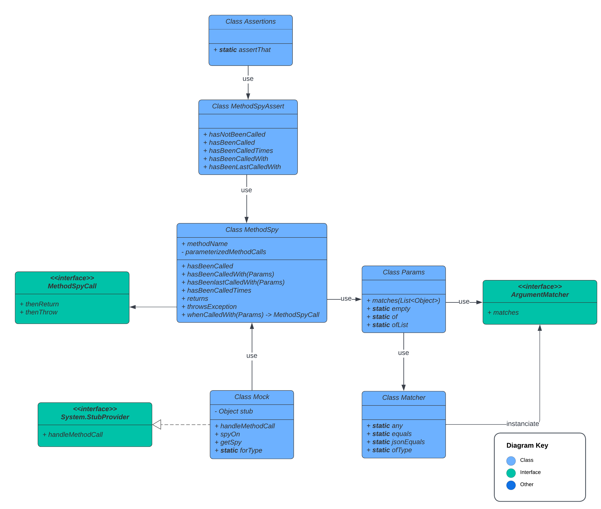

[](https://github.com/salesforce/apex-mockery/actions?query=workflow%3Amain) [](https://github.com/salesforce/apex-mockery/actions?query=workflow%3Arelease)

<div align="center">
	
	<h1>Lightweight mocking library in Apex</h1>  
</div>

This project provide a simple, lightweight, easy to read, fully tested mocking library for apex built using the [Apex Stub API](https://developer.salesforce.com/docs/atlas.en-us.apexcode.meta/apexcode/apex_testing_stub_api.htm).
We want its usage to be simple, its maintainability to be easy and to provide the best developer experience possible

<!-- TABLE OF CONTENTS -->
<details>
  <summary>Table of Contents</summary>

- [Principles](#principles)
  - [Why you should use the library](#why-you-should-use-the-library)
- [Installation](#installation)
  - [Namespaced Org /!\\](#namespaced-org-)
- [Usage](#usage)
  - [Mock](#mock)
    - [How to stub namespaced type?](#how-to-stub-namespaced-type)
  - [Stub](#stub)
  - [Spy](#spy)
    - [How to Configure a spy](#how-to-configure-a-spy)
      - [Default behaviour](#default-behaviour)
      - [Global returns](#global-returns)
      - [Global throws](#global-throws)
      - [Parameterized configuration](#parameterized-configuration)
      - [Configuration order matters !](#configuration-order-matters-)
  - [Assert on a spy](#assert-on-a-spy)
  - [Arguments](#arguments)
  - [Argument matcher](#argument-matcher)
    - [Any](#any)
    - [Equal](#equal)
    - [jsonEqual](#jsonequal)
    - [ofType](#oftype)
    - [BYOM (Build your own matcher)](#byom-build-your-own-matcher)
  - [Recipes](#recipes)
    - [Mocking](#mocking)
    - [Asserting](#asserting)
- [Library architecture](#library-architecture)
- [Authors](#authors)
- [Contributing](#contributing)
- [License](#license)
</details>

## Principles

APIs design come from our experience with Mockito, chai.js, sinon.js and jest.
The library aims to provide developers a simple way to stub, mock, spy and assert their implementations.
Dependency Injection and Inversion Of Control are key architectural concepts the system under test should implements

### Why you should use the library

It helps you isolate the code from its dependency in unit test.
Using the library to mock your classes dependencies will contribute to improve code quality and maintanibility of your project.

It helps you write unit test by driving the behavior of the class dependencies (instead of relying on it by integration).
Using the library to mock DML and SOQL from your tests will help you save a lot of time in apex test execution (the tests will not sollicitate the database anymore).

## Installation

Deploy via the deploy button

<a href="https://githubsfdeploy.herokuapp.com?owner=salesforce&repo=apex-mockery&ref=main">
  
</a>

Or copy `force-app/src/classes` apex classes in your sfdx project to deploy it with your favourite deployment methods

Or you can install the library using our unlocked package without namespace from the [latest release](https://github.com/salesforce/apex-mockery/releases/latest)

### Namespaced Org /!\

It's [not possible](https://developer.salesforce.com/docs/atlas.en-us.sfdx_dev.meta/sfdx_dev/sfdx_dev_unlocked_pkg_namespace_collisions.htm#:~:text=You%20can%E2%80%99t%20install%20a%20no%2Dnamespace%20unlocked%20package%20in%20an%20org%20with%20a%20namespace.) to install a non namespaced unlocked package into a namespaced org.

In this case you have those choices:

- Install from sources (with or without manually prefixing classes)
- Create your own unlocked/2GP package with your namespace containing the sources

It's [not recommended](https://developer.salesforce.com/docs/atlas.en-us.sfdx_dev.meta/sfdx_dev/sfdx_dev_dev2gp_dependency_overview.htm#:~:text=Can%20a%20managed%202GP%20package%20depend%20on%20an,on%20a%20managed%201GP%20or%20managed%202GP%20package.) for a 2GP package to depends on an unlocked package, namespaced or not (ISV scenario).

## Usage

### Mock

To mock an instance, use the `Mock.forType` method
It returns a Mock instance containing the stub and all the mechanism to spy/configure/assert

```java
Mock myMock = Mock.forType(MyType.class);
```

#### How to stub namespaced type?

Because `Test.createStub()` call [cannot cross namespace](<https://developer.salesforce.com/docs/atlas.en-us.apexcode.meta/apexcode/apex_testing_stub_api.htm#:~:text=The%20object%20being%20mocked%20must%20be%20in%20the%20same%20namespace%20as%20the%20call%20to%20the%20Test.createStub()%20method.%20However%2C%20the%20implementation%20of%20the%20StubProvider%20interface%20can%20be%20in%20another%20namespace.>), we provide a `StubBuilder` interface to stub type from your namespace.
Create a `StubBuilder` implementation in your namespace (it must be the same implementation as the `Mock.DefaultStubBuilder` implementation but has to be in your namespace to build type from your namespace).

```java
Mock myMock = Mock.forType(MyType.class, new MyNamespace.MyStubBuilder());
```

### Stub

Use the `stub` attribut to access the stub,

```java
MyType myTypeStub = (MyType) myMock.stub;
MyService myServiceInstance = new MyServiceImpl(myTypeStub);
```

### Spy

Use the `spyOn` method from the mock to spy on a method,
It returns a `MethodSpy` instance containing all the tools to drive its behaviour and spy on it

```java
MethodSpy myMethodSpy = myMock.spyOn('myMethod');
```

#### How to Configure a spy

##### Default behaviour

By default, a spy return `null` when called, whatever the parameters received.

```java
// Act
Object result = myTypeStub.myMethod();
// Assert
Assert.areEqual(null, result);
```

Have a look at the [NoConfiguration recipe](force-app/recipes/classes/mocking/NoConfiguration.cls)

##### Global returns

Configure it to return a specific value, whatever the parameter received
The stub will always return the configured value

```java
// Arrange
myMethodSpy.returns(new Account(Name='Test'));
// Act
Object result = myTypeStub.myMethod();
// Assert
Assert.areEqual(new Account(Name='Test'), result);
```

Have a look at the [Returns recipe](force-app/recipes/classes/mocking/Returns.cls)

##### Global throws

Configure it to throw a specific exception, whatever the parameter received
The stub will always throw the configured exception

```java
// Arrange
myMethodSpy.throwsException(new MyException());
try {
    // Act
    Object result = myTypeStub.myMethod();

    // Assert
    Assert.fail('Expected exception was not thrown');
} catch (Exception ex) {
    Assert.isInstanceOfType(ex, MyException.class);
}
```

Have a look at the [Throws recipe](force-app/recipes/classes/mocking/Throws.cls)

##### Parameterized configuration

Configure it to return a specific value, when call with specific parameters
Configure it to throw a specific value, when call with specific parameters

```java
// Arrange
myMethodSpy
    .whenCalledWith(Argument.any(), 10)
    .thenReturn(new Account(Name='Test'));

// Arrange
myMethodSpy
    .whenCalledWith(Argument.any(), -1)
    .thenThrow(new MyException);

// Act
Object result = myTypeStub.myMethod('nothing', 10);

// Assert
Assert.areEqual(new Account(Name='Test'), result);

// Act
try {
    Object result = myTypeStub.myMethod('value', -1);

    // Assert
    Assert.fail('Expected exception was not thrown');
} catch (Exception ex) {
    Assert.isInstanceOfType(ex, MyException.class);
}
```

Have a look at the [mocking recipes](force-app/recipes/classes/mocking/) to have a deeper overview of what you can do with the mocking API.

##### Configuration order matters !

**TL;DR**

The order of the spy configuration drive how it will behave.

1. If no configuration at all, then return null (default behavior).
1. Then, it checks the `whenCalledWith` configurations.
1. Then, it checks the global `returns` configurations.
1. Then, it checks the global `throwsException` configurations.

If there is a configuration and it does not match then it throws a `ConfigurationException`.
The error message will contains the arguments and the configuration.
Use it to help you understand the root cause of the issue (configuration/regression/you name it).

The order of the global configuration matters.
If global throw is setup after global returns then `throwException` will apply.

```java
myMethodSpy.returns(new Account(Name='Test'));
myMethodSpy.throwsException(new MyException());
Object result = myTypeStub.myMethod(); // throws
```

If global returns is setup after global throw then `returns` will apply

```java
myMethodSpy.throwsException(new MyException());
myMethodSpy.returns(new Account(Name='Test'));
Object result = myTypeStub.myMethod(); // return configured value
```

For global configuration, the last configured will apply.
Same as if you would have configured the spy twice to return (or throw), the last global configuration would be the one kept.

### Assert on a spy

Use the `Expect` class to assert on a spy
It exposes the method `that` and returns a `MethodSpyExpect` type.
Use the convenient assertion methods the following way:

```java
// hasNotBeenCalled
Expect.that(myMethodSpy).hasNotBeenCalled();

// hasBeenCalled
Expect.that(myMethodSpy).hasBeenCalled();

// hasBeenCalledTimes
Expect.that(myMethodSpy).hasBeenCalledTimes(2);

// hasBeenCalledWith
Expect.that(myMethodSpy).hasBeenCalledWith('stringValue', Argument.any(), true, ...); // up to 5 parameters
Expect.that(myMethodSpy).hasBeenCalledWith(Arguments.ofList(new List<Object>{Argument.any(), Argument.any(), ... })); // for more than 5 parameters

// hasBeenLastCalledWith
Expect.that(myMethodSpy).hasBeenLastCalledWith('stringValue', Argument.any(), true, ...); // up to 5 parameters
Expect.that(myMethodSpy).hasBeenLastCalledWith(Arguments.ofList(new List<Object>{Argument.any(), Argument.any(), ... })); // for more than 5 parameters
```

Have a look at the [assertions recipes](force-app/recipes/classes/asserting/) to have a deeper overview of what you can do with the assertion API

### Arguments

Configuring a stub (`spy.whenCalledWith(...)`) and asserting (`Expect.that(myMethodSpy).hasBeenCalledWith` and `Expect.that(myMethodSpy).hasBeenLastCalledWith`) a stub uses `Arguments` matchers.

You can either use raw values with notation like `spy.whenCallWith('value1', false, ...)`or `hasBeenCalledWith(param1, param2, ...)` up to 5 arguments.

It wrapes value with a `Argument.equals` when called with any kind of parameter.

When called with a `Argument.Matchable` type, it considers it as a parameter, use it directly without wrapping it with a `Argument.equals`.

If you need more arguments in your method calls, `Arguments` offers the `ofList` API to create parameters for that, so that you can do `spy.whenCallWith(Arguments.ofList(new List<Object>{...})))`or `hasBeenCalledWith(Arguments.ofList(new List<Object>{...}))))`

```java
Arguments emptyParameters = Arguments.empty();

Arguments myMethodParameters = Arguments.of(10, 'string'); // Up to five

Arguments myMethodWithLongParameters = Arguments.ofList(new List<Object>{10, 'string', true, 20, false, 'Sure'});
```

### Argument matcher

The library provide OOTB (out of the box) Matchables ready for use and fully tested.
The library accept your own matchers for specific use cases and reusability.

#### Any

`Argument.any()` matches anything

```java
Argument.any();
```

#### Equal

`Argument.equals()` (the default) matches with native deep equals

```java
Argument.equals(10);
```

#### jsonEqual

`Argument.jsonEquals(new WithoutEqualsType())` matches with json string equals. Convenient to match without `equals` type

```java
Argument.jsonEquals(new WithoutEqualsType(10, true, '...'));
```

Namespaced custom types must add the `@JsonAccess` [annotation](https://developer.salesforce.com/docs/atlas.en-us.apexcode.meta/apexcode/apex_classes_annotation_JsonAccess.htm) with `serializable='always' to the class when using the unlocked package version.

#### ofType

`Argument.ofType()` matches on the parameter type

```java
// To match any Integer
Argument.ofType('Integer');
// To match any Account SObject
Argument.ofType(Account.getSObjectType());
// To match any CustomType class instance
Argument.ofType(CustomType.class);
```

#### BYOM (Build your own matcher)

Use the `Argument.Matchable` interface and then use it with `Arguments` APIs

```java
@isTest
public class MyMatchable implements Argument.Matchable {
  public Boolean matches(Object callArgument) {
    boolean matches = false;

    // custom logic to determine if it matches here
    ...

    return matches;
  }
}

Arguments param = Arguments.of(new MyMatchable(), ...otherArguments);
```

Have a look at the [overview recipes](force-app/recipes/classes/ApexMockeryOverview.cls) to have a deeper overview of what you can do with the library

### Recipes

They have their own [folder](force-app/recipes/).
It contains usage example for `mocking` and `asserting`
It contains one classe for each use cases the library covers

#### Mocking

- [No Configuration](force-app/recipes/classes/mocking/NoConfiguration.cls): spy not configured
- [Returns](force-app/recipes/classes/mocking/Returns.cls): spy configured to return
- [ReturnsThenThrows](force-app/recipes/classes/mocking/ReturnsThenThrows.cls): spy configured to throw
- [Throws](force-app/recipes/classes/mocking/Throws.cls): spy configured to throw
- [ThrowsThenReturns](force-app/recipes/classes/mocking/ThrowsThenReturns.cls): spy configured to return
- [WhenCalledWithCustomMatchable_ThenReturn](force-app/recipes/classes/mocking/WhenCalledWithCustomMatchable_ThenReturn.cls): spy configured with custom matcher to return
- [WhenCalledWithEqualMatching_ThenReturn](force-app/recipes/classes/mocking/WhenCalledWithEqualMatching_ThenReturn.cls): spy configured with equals matcher to return
- [WhenCalledWithJSONMatching_ThenReturn](force-app/recipes/classes/mocking/WhenCalledWithJSONMatching_ThenReturn.cls): spy configured with JSON matcher to return
- [WhenCalledWithMatchingThrowsAndReturns](force-app/recipes/classes/mocking/WhenCalledWithMatchingThrowsAndReturns.cls): spy configured with matcher to return and to throw
- [WhenCalledWithNotMatchingAndReturn](force-app/recipes/classes/mocking/WhenCalledWithNotMatchingAndReturn.cls): spy configured with matcher and global return, called without matching parameters
- [WhenCalledWithTypeMatching_ThenReturn](force-app/recipes/classes/mocking/WhenCalledWithTypeMatching_ThenReturn.cls): spy configured with type matcher to return
- [WhenCalledWith_ThenThrow](force-app/recipes/classes/mocking/WhenCalledWith_ThenThrow.cls): spy configured with JSON matcher to throw
- [WhenCalledWithoutMatchingConfiguration](force-app/recipes/classes/mocking/WhenCalledWithoutMatchingConfiguration.cls): spy configured and called without matching parameters

#### Asserting

- [HasBeenCalled](force-app/recipes/classes/asserting/HasBeenCalled.cls): spy called
- [HasBeenCalledTimes](force-app/recipes/classes/asserting/HasBeenCalledTimes.cls): spy called times
- [HasBeenCalledWith](force-app/recipes/classes/asserting/HasBeenCalledWith.cls): spy called with equal matcher
- [HasBeenCalledWithCustomMatchable](force-app/recipes/classes/asserting/HasBeenCalledWithCustomMatchable.cls): spy called with custom matcher
- [HasBeenCalledWithJSONMatchable](force-app/recipes/classes/asserting/HasBeenCalledWithJSONMatchable.cls): spy called with JSON matcher
- [HasBeenCalledWithTypeMatchable](force-app/recipes/classes/asserting/HasBeenCalledWithTypeMatchable.cls): spy called with type matcher
- [HasBeenLastCalledWith](force-app/recipes/classes/asserting/HasBeenLastCalledWith.cls): spy last called with equal matcher
- [HasNotBeenCalled](force-app/recipes/classes/asserting/HasNotBeenCalled.cls): spy not called

## Library architecture

The library repository has 3 parts:

- Test classes in the `force-app/src` folder are what you need to use the lib, no more. Installation button deploy this folder.
- Test classes in the `force-app/test` folder are what we need to maintain the library and is not required in production.
- Test classes in the `force-app/recipes` folder are what you can use to have a deeper understanding of the library usages.



## Authors

- **Sebastien Colladon** - Developer - [scolladon-sfdc](https://github.com/scolladon-sfdc)
- **Ludovic Meurillon** - Architect - [LudoMeurillon](https://github.com/LudoMeurillon) _Initial work_

## Contributing

Any contributions you make are **appreciated**.

See [contributing.md](/CONTRIBUTING.md) for apex-mockery contribution principles.

## License

This project license is BSD 3 - see the [LICENSE.md](LICENSE.md) file for details
