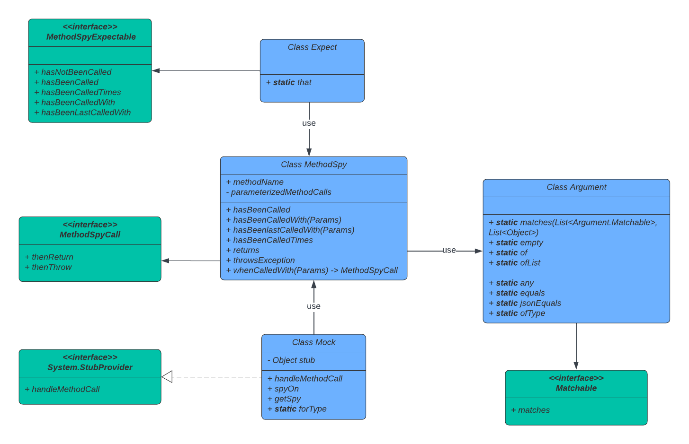

<div align="center">
	
	<h1>Lightweight mocking library in Apex</h1>
</div>

This project provide a simple, lightweight, easy to read, fully tested mocking library for apex.
We want its usage to be simple, its maintainability to be easy and to provide the best developer experience possible

## Principles

APIs design come from our experience with Mockito, chai.js, sinon.js and jest.
The library aims to provide developers a simple way to stub, mock, spy and assert their implementations.
Dependency Injection and Inversion Of Control are key architectural concepts the system under test should implements

### Why you should use the library

It helps you isolate the code from its dependency in unit test.
Using the library to mock your classes dependencies will contribute to improve code quality and maintanibility of your project.

It helps you write unit test by driving the behavior of the class dependencies (instead of relying on it by integration).
Using the library to mock DML and SOQL from your tests will help you save a lot of time in apex test execution (the tests will not sollicitate the database anymore).

## Installation

Deploy via the deploy button

<a href="https://githubsfdeploy.herokuapp.com?owner=salesforce&repo=apex-mockery&ref=main">
  
</a>

Or copy `force-app/src/classes` test classes in your sfdx project to deploy it with your favourite deployment methods

Or you can deploy the library with an upcoming managed package

## Usage

### Mock

To mock an instance, use the `Mock.forType` method
It returns a Mock instance containing the stub and all the mechanism to spy/configure/assert

```java
final Mock myMock = Mock.forType(MyType.class);
```

### Stub

Use the `stub` attribut to access the stub,

```java
final MyType myTypeStub = (MyType) myMock.stub
final MyService myServiceInstance = new MyServiceImpl(myTypeStub);
```

### Spy

Use the `spyOn` method from the mock to spy on a method,
It returns a `MethodSpy` instance containing all the tools to drive its behaviour and spy on it

```java
final MethodSpy myMethodSpy = myMock.spyOn('myMethod');
```

#### How to Configure a spy

##### Default behaviour

By default, a spy return `null` when called, whatever the parameters received.

```java
// Act
Object result = myTypeStub.myMethod();
// Assert
Assert.areEqual(null, result);
```

Have a look at the [NoConfiguration recipe](force-app/recipes/classes/mocking/NoConfiguration.cls)

##### Global returns

Configure it to return a specific value, whatever the parameter received
The stub will always return the configured value

```java
// Arrange
myMethodSpy.returns(new Account(Name='Test'));
// Act
Object result = myTypeStub.myMethod();
// Assert
Assert.areEqual(new Account(Name='Test'), result);
```

Have a look at the [Returns recipe](force-app/recipes/classes/mocking/Returns.cls)

##### Global throws

Configure it to throw a specific exception, whatever the parameter received
The stub will always throw the configured exception

```java
// Arrange
myMethodSpy.throwsException(new MyException());
try {
    // Act
    Object result = myTypeStub.myMethod();

    // Assert
    Assert.fail('Expected exception was not thrown');
} catch (Exception ex) {
    Assert.isInstanceOfType(ex, MyException.class);
}
```

Have a look at the [Throws recipe](force-app/recipes/classes/mocking/Throws.cls)

##### Parameterized configuration

Configure it to return a specific value, when call with specific parameters
Configure it to throw a specific value, when call with specific parameters

```java
// Arrange
myMethodSpy
    .whenCalledWith(Matcher.any(), 10)
    .thenReturn(new Account(Name='Test'));

// Arrange
myMethodSpy
    .whenCalledWith(Matcher.any(), -1)
    .thenThrow(new MyException);

// Act
Object result = myTypeStub.myMethod('nothing', 10);

// Assert
Assert.areEqual(new Account(Name='Test'), result);

// Act
try {
    Object result = myTypeStub.myMethod('value', -1);

    // Assert
    Assert.fail('Expected exception was not thrown');
} catch (Exception ex) {
    Assert.isInstanceOfType(ex, MyException.class);
}
```

Have a look at the [recipes](force-app/recipes/classes/mocking/) to have a deeper overview of what you can do with the mocking API.

##### Configuration order matters !

**TL;DR**
If no configuration at all, then return null (default behavior)
Then, it check the `whenCalledWith` configurations
Then, it check the global `returns` configurations
Then, it check the global `throwsException` configurations
If no configuration matches then it throws a `ConfigurationException`

The order of the spy configuration drive how it will behave.
If the spy is not configured it will return `null` (default behavior).

When configured with a Param Matcher (`whenCalledWith()` API), the spy will always try to find if the parameters actually passed to the stub match the confiugration.

Then it will look for global configuration (`returns()` or `throwException` APIs).

The order of the global configuration matters
If global returns is setup before global throw then `throwException` will apply

```java
myMethodSpy.returns(new Account(Name='Test'));
myMethodSpy.throwsException(new MyException());
Object result = myTypeStub.myMethod(); // throws
```

If global throw is setup before global return then `returns` will apply

```java
myMethodSpy.throwsException(new MyException());
myMethodSpy.returns(new Account(Name='Test'));
Object result = myTypeStub.myMethod(); // return configured value
```

Last global configuration will apply.
Same as if you would have configured the spy twice to return (or throw), the last global configuration would be the one kept.

If the spy does not find a match or does not have a global return neither a global throw configured then it will throw a `ConfigurationException` with an explanation.
Use the exception message to help you understand the root cause of the issue (configuration/regression/you name it)

### Assert on a spy

Use the `Assertion` class to assert on a spy
It exposes the method `assertThat` and returns a `MethodSpyAssertions` type.
Use the convenient assertion methods the following way:

```java
// hasNotBeenCalled
Assertions.assertThat(myMethodSpy).hasNotBeenCalled();

// hasBeenCalled
Assertions.assertThat(myMethodSpy).hasBeenCalled();

// hasBeenCalledTimes
Assertions.assertThat(myMethodSpy).hasBeenCalledTimes(2);

// hasBeenCalledWith
Assertions.assertThat(myMethodSpy).hasBeenCalledWith('stringValue', Matcher.any(), true, ...); // up to 5 params
Assertions.assertThat(myMethodSpy).hasBeenCalledWith(Params.ofList(new List<Object>{Matcher.any(), Matcher.any(), ... })); // for more than 5 params

// hasBeenLastCalledWith
Assertions.assertThat(myMethodSpy).hasBeenLastCalledWith('stringValue', Matcher.any(), true, ...); // up to 5 params
Assertions.assertThat(myMethodSpy).hasBeenLastCalledWith(Params.ofList(new List<Object>{Matcher.any(), Matcher.any(), ... })); // for more than 5 params
```

Have a look at the [recipes](force-app/recipes/classes/asserting/) to have a deeper overview of what you can do with the assertion API

### Params

Configuring a stub (`spy.whenCalledWith(...)`) and asserting (`Assertions.assertThat(myMethodSpy).hasBeenCalledWith` and `Assertions.assertThat(myMethodSpy).hasBeenLastCalledWith`) a stub uses `Params` matchers.

You can either use raw values with notation like `spy.whenCallWith('value1', false, ...)`or `hasBeenCalledWith(param1, param2, ...)` up to 5 arguments.
It wrapes values with a `Matcher.equals` when called with any kind of parameter.
It uses the Matcher set when called with a `Matcher.ArgumentMatcher` type.

If you need more arguments in your method calls, `Params` offers the `ofList` API to create parameters for that, so that you can do `spy.whenCallWith(Params.ofList(new List<Object>{...})))`or `hasBeenCalledWith(Params.ofList(new List<Object>{...}))))`

```java
Params emptyParameters = Params.empty();

Params myMethodParameters = Params.of(10, 'string'); // Up to five

Params myMethodWithLongParameters = Params.ofList(new List<Object>{10, 'string', true, 20, false, 'Sure'});
```

### Matchers

The library provide OOTB (out of the box) Matchers ready for use and fully tested.
The library accept your own matchers for specific use cases and reusability.

#### Any

`Matcher.any()` matches anything

```java
Matcher.any();
```

#### Equal

`Matcher.equals()` (the default) matches with native deep equals

```java
Matcher.equals(10);
```

#### jsonEqual

`Matcher.jsonEquals(new WithoutEqualsType())` matches with json string equals. Convenient to match without `equals` type

```java
Matcher.jsonEquals(new WithoutEqualsType(10, true, '...'));
```

#### ofType

`Matcher.ofType()` matches on the parameter type

```java
// To match any Integer
Matcher.ofType('Integer');
// To match any Account SObject
Matcher.ofType(Account.getSObjectType());
// To match any CustomType class instance
Matcher.ofType(CustomType.class);
```

#### BYOM (Build your own matcher)

Use the `Matcher.ArgumentMatcher` interface and then use it with `Params` APIs

```java
@isTest
public class MyMatcher implements Matcher.ArgumentMatcher {
  public Boolean matches(final Object callArgument) {
    boolean matches = false;

    // custom logic to determine if it matches here
    ...

    return matches;
  }
}

Params param = Params.of(new MyMatcher(), ...otherParams);
```

Have a look at the [overview recipes](force-app/recipes/classes/ApexMockeryOverview.cls) to have a deeper overview of what you can do with the library

### Library architecture

The library repository has 3 parts:

- Test classes in the `force-app/src` folder are what you need to use the lib, no more. Installation button deploy this folder.
- Test classes in the `force-app/test` folder are what we need to maintain the library and is not required in production.
- Test classes in the `force-app/recipes` folder are what you can use to have a deeper understanding of the library usages.



## Authors

- **Sebastien Colladon** - Developer - [scolladon-sfdc](https://github.com/scolladon-sfdc)
- **Ludovic Meurillon** - Architect - [LudoMeurillon](https://github.com/LudoMeurillon) _Initial work_

## Contributing

Any contributions you make are **appreciated**.

See [contributing.md](/CONTRIBUTING.md) for apex-mockery contribution principles.

## License

This project license is BSD 3 - see the [LICENSE.md](LICENSE.md) file for details
